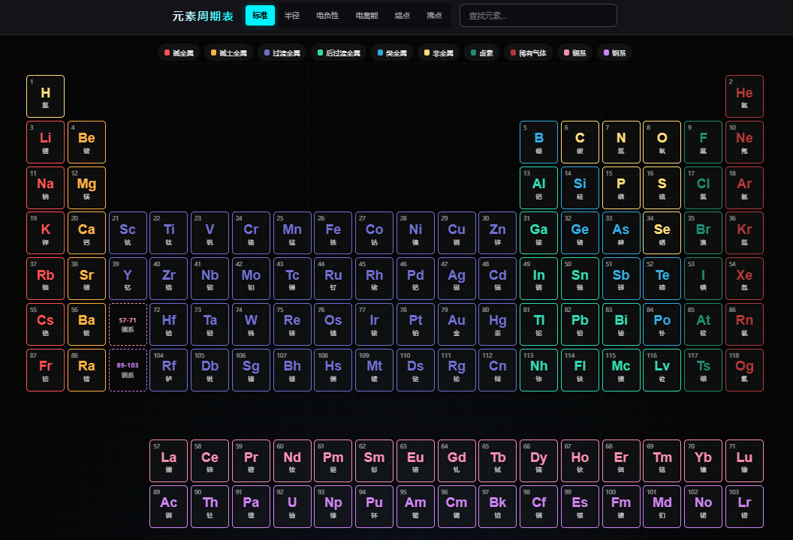
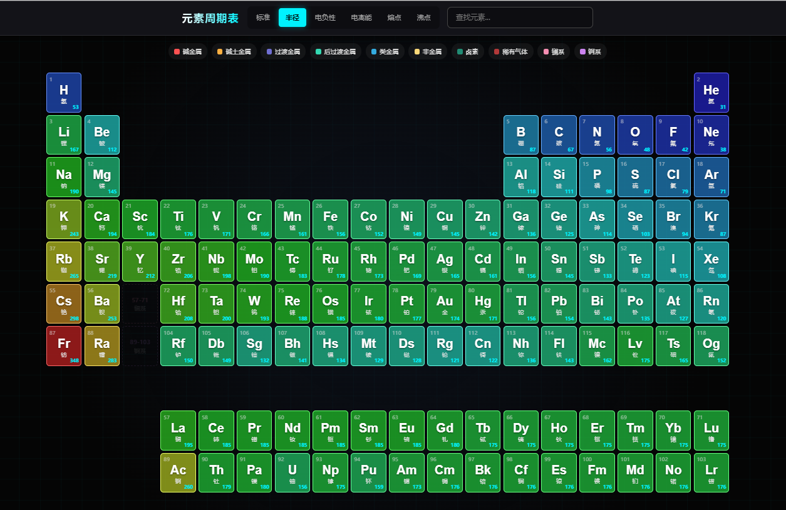
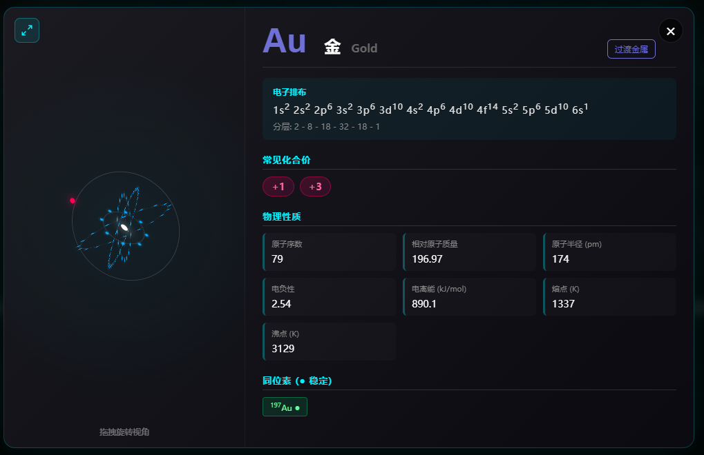
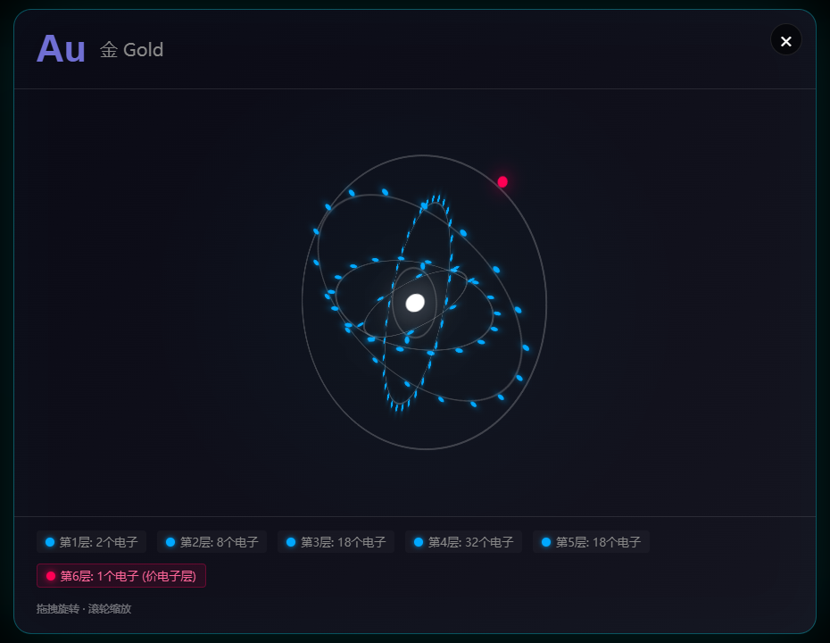

<div align="center">
  <h1>⚛️ Future Style Periodic Table</h1>
  <h3>交互式未来风格元素周期表 · 沉浸式化学科普 · 中英文双语支持</h3>
  
  <p>
    118 种元素，宇宙的 5%，尽在指尖绽放。
  </p>

  <p>
    <a href="https://github.com/ruanyf/weekly/blob/master/docs/issue-383.md">
        
    </a>
    
    
    
    
    
  </p>

  <h3>
    👉 <a href="https://open-bbug.github.io/Future-Style-Periodic-Table/">点击进入：沉浸式体验 (Live Demo)</a> 👈
  </h3>

  <h4>
    📖 <a href="README.md">繁體中文版</a> | <a href="README_en.md">English Version</a>
  </h4>

</div>

---

## 📖 简介 (Introduction)

**Future Style Periodic Table** 是一个运行于现代浏览器的交互式化学元素周期表。不同于传统的静态图表，本项目采用深色赛博朋克（Cyberpunk）风格，融合霓虹光效、玻璃拟态（Glassmorphism）与流畅的交互动画，重新定义化学元素的视觉呈现。

项目涵盖全部 **118 种化学元素**，包含原子序数、相对原子质量、电子排布、同位素、化合价等详尽数据，并支持多维度热力图可视化与 3D 原子结构模拟，是学习化学知识与探索前端技术的绝佳实践。

> **🌟 亮点：** 点击任意元素，即可进入沉浸式详情页，拖拽旋转 3D 原子模型，感受电子云的轨道之美。支持中英文双语切换，满足全球用户需求。

---

## ✨ 核心特性 (Features)

### 🎨 沉浸式视觉体验
- **赛博朋克美学**：深色背景搭配动态网格粒子，营造科技感十足的沉浸氛围。
- **霓虹分类高亮**：10 大元素分类采用独特配色，悬停时边框发光流转。
- **全响应式适配**：从 4K 桌面到移动端，均有优雅的布局表现（含横屏提示）。
- **双语支持**：一键切换中文/英文界面，满足不同语言用户的需求。

### 📊 多维度数据可视化
- **热力图模式**：一键切换原子半径、电负性、电离能、熔点、沸点的色谱分布。
- **分类筛选**：点击图例即可高亮特定类别（碱金属、稀有气体、镧系/锕系等）。
- **实时搜索**：支持通过元素符号、中英文名称或原子序数快速定位。

### 🔬 3D 原子结构模拟
- **CSS 3D 轨道模型**：基于电子排布算法实时渲染电子层与旋转电子。
- **交互升级**：支持鼠标拖拽 / 触屏滑动，360° 旋转观察原子结构。
- **独立放大视图**：点击模型左上角图标可进入全屏模式，支持**滚轮缩放**查看电子层细节，沉浸感倍增。
- **详尽数据卡片**：展示电子排布式、分层电子数、同位素稳定性、常见化合价等。

---

## 📸 预览 (Screenshots)

**周期表总览**


**热力图模式**


<table>
  <tr>
    <th width="54%">元素详情卡片</th>
    <th width="46%">3D 原子模型</th>
  </tr>
  <tr>
    <td valign="top"></td>
    <td valign="top"></td>
  </tr>
</table>

---

## 🛠️ 技术栈 (Tech Stack)

本项目采用 **TypeScript + Vite** 开发，模块化架构，类型安全。

| 技术 | 用途 |
|:---|:---|
| **TypeScript** | 类型安全的业务逻辑、数据处理、事件交互 |
| **Vite** | 开发服务器、构建打包、模块热替换 |
| **HTML5** | 语义化结构与 DOM 容器 |
| **CSS3** | Grid/Flexbox 布局、3D Transforms、CSS Variables、Media Queries |

### 技术亮点

- 📐 **CSS Grid**：精确绘制非规则的周期表网格布局。
- 🎭 **CSS 3D Transforms**：`transform-style: preserve-3d` 实现电子轨道旋转。
- 🎨 **CSS Variables**：主题颜色统一管理，便于自定义。
- 📱 **Responsive Design**：多断点媒体查询，适配各类屏幕尺寸。
- 🔒 **TypeScript Strict Mode**：完整的类型覆盖，编译期捕获错误。
- 🧩 **模块化设计**：功能拆分为独立模块（table、modal、atom3d、heatmap 等），职责清晰。

---

## 📂 目录结构 (Structure)

项目采用清晰的模块化结构，TypeScript + Vite 构建。

```
Future-Style-Periodic-Table/
├── public/images/           # 预览截图
├── src/                     # 源代码
│   ├── css/
│   │   └── styles.css       # 样式文件
│   ├── types/
│   │   ├── app.ts           # 枚举、类型定义 (Mode, Tab, Language)
│   │   └── element.ts       # 元素数据接口 (Element, RawElement, Category)
│   ├── config/
│   │   ├── categories.ts    # 10 大元素分类 + 颜色
│   │   └── electron.ts      # 电子排布算法 (轨道填充规则 + 例外)
│   ├── data/
│   │   ├── elements.json    # 118 种元素的完整数据
│   │   └── index.ts         # 数据处理函数
│   ├── i18n/
│   │   ├── zh.ts            # 中文翻译
│   │   ├── en.ts            # 英文翻译
│   │   └── index.ts         # t() 翻译函数 + 工具
│   ├── state/
│   │   └── index.ts         # 集中式状态管理
│   ├── modules/
│   │   ├── table.ts         # 周期表渲染 + 定位算法
│   │   ├── legend.ts        # 分类图例 + 筛选
│   │   ├── heatmap.ts       # 热力图模式 (7 种)
│   │   ├── atom3d.ts        # 3D 原子模型 + 拖拽/缩放
│   │   ├── modal.ts         # 详情弹窗 + 5 个标签页
│   │   ├── media.ts         # 图片懒加载 + 超时重试
│   │   └── search.ts        # 搜索过滤
│   ├── utils/
│   │   └── dom.ts           # DOM 辅助函数
│   └── main.ts              # 入口：初始化 + 事件绑定
├── index.html               # 入口 HTML
├── package.json             # 依赖管理
├── tsconfig.json            # TypeScript 配置
├── vite.config.ts           # Vite 构建配置
├── .github/workflows/
│   └── deploy.yml           # GitHub Pages 自动部署
├── README.md                # 繁体中文文档
├── README_zh-CN.md          # 简体中文文档
├── README_en.md             # 英文文档
└── LICENSE                  # MIT 开源协议
```

---

## 🚀 快速开始 (How to Run)

### 开发环境

```bash
# 克隆项目
git clone https://github.com/open-bbug/Future-Style-Periodic-Table.git
cd Future-Style-Periodic-Table

# 安装依赖
npm install

# 启动开发服务器
npm run dev
```

然后访问 `http://localhost:5173/Future-Style-Periodic-Table/`

### 构建部署

```bash
# 生产构建
npm run build

# 预览构建结果
npm run preview
```

推送到 `main` 分支会通过 GitHub Actions 自动部署到 GitHub Pages。

### 浏览器兼容性
- ✅ Chrome 90+
- ✅ Firefox 88+
- ✅ Safari 14+
- ✅ Edge 90+

---

## ⚠️ 科学声明

本项目中的 **3D 原子模型为简化的玻尔模型可视化**，仅用于教学演示目的，**并非真实的电子云概率分布**。实际电子行为遵循量子力学原理，电子以概率云形式存在于原子轨道中。

---

## 🤝 致谢 (Credits)

本项目的完善离不开社区的支持，特别感谢以下贡献者：

- **代码贡献**：感谢 [Melody Young (@keepwow)](https://github.com/keepwow) 提供的英文适配与国际化支持。

- **数据来源**：
  - 主要元素 data 来自 [Bowserinator/Periodic-Table-JSON](https://github.com/Bowserinator/Periodic-Table-JSON)，采用 [CC BY-SA 3.0](https://creativecommons.org/licenses/by-sa/3.0/) 许可证
  - 化合价与同位素数据基于公开资料整理

- **原始灵感**：[抖音视频链接](https://www.douyin.com/video/7575067444734622385)
>  - *如果您希望参与贡献或修改署名方式，请随时提交 Pull Request 或 Issue。*
  ---

## 📄 开源协议 (License)

本项目采用 [MIT License](LICENSE) 开源协议。

- ✅ 你可以自由地使用、复制、修改和分发本项目。
- 📝 请在衍生作品中保留原作者的版权声明。

---

## 📈 Star History

[](https://star-history.com/#open-bbug/Future-Style-Periodic-Table&Date)

---
<div align="center">
  <sub>Designed with ❤️ by Sean Wong</sub>
</div>
